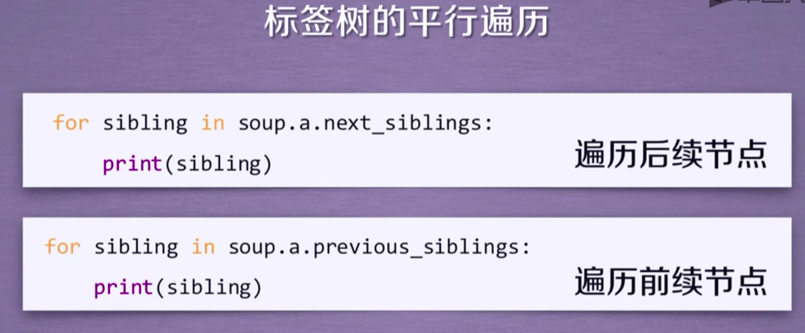

## BeautifulSoup

```py
from bs4 import BeautifulSoup
soup = BeautifulSoup("<p>date</p>", "html.parser")
```


## BeautifulSoup 库解析器

| 解析器           | 使用方法                         | 条件                 |
| ---              | ---                              | ---                  |
| bs4的html解析器  | BeautifulSoup(mk, "html.parser") | 安装bs4              |
| lxml的html解析器 | BeautifulSoup(mk, "lxml")        | pip install lxml     |
| lxml的xml解析器  | BeautifulSoup(mk, "xml")         | pip install lxml     |
| html5lib的解析器 | BeautifulSoup(mk, "html5lib")    | pip install html5lib |

## BeautifulSoup 类的基本元素

| 基本元素        | 说明                                                    |
| ---             | ---                                                     |
| Tag             | 标签，最基本的信息组织单元，分别用<>和</>标明开头和结尾 |
| Name            | 标签的名字，<p> </p>的名字是“p”，格式：<tag>.name       |
| Attributes      | 标签的属性，字典形式组织，格式：<tag>.attrs             |
| NavigableString | 标签内非属性字符串，<> </>中字符串，格式：<tag>.string  |
| Comment         | 标签内字符串的注释部分，一种特殊的Comment类型           |


## 标签树的下行遍历

```py
# 遍历子节点
for child in soup.body.children:
    print(child)

# 遍历所有子孙节点
for child in soup.body.descendants:
    print(child)
```





