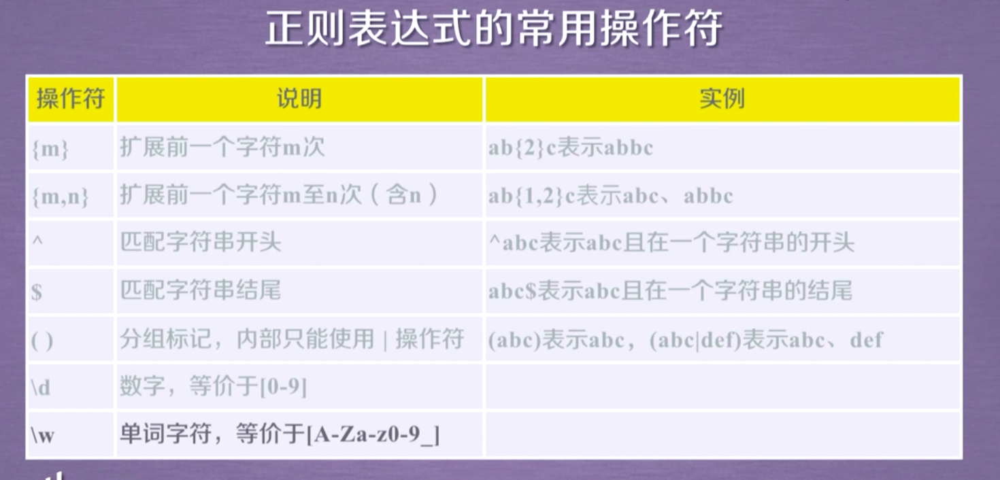

## 正则表达式 —— regular expression

### 正则表达式
- **通用的字符串表达框架**
- **简洁表达一组字符串的表达式**
- **针对字符串表达“简洁”和“特征”思想的工具**
- **判断某字符串的特征归属**

### 正则表达式在文本处理中十分常用
- **表达文本类型的特征（病毒、入侵等）**
- **同时查找或替换一组字符串**
- **匹配字符串的全部或部分**

### 正则表达式的语法

## Re 库的使用

### Re 库是Python的标准库，主要用于字符串匹配

- 调用方式：`import re`

