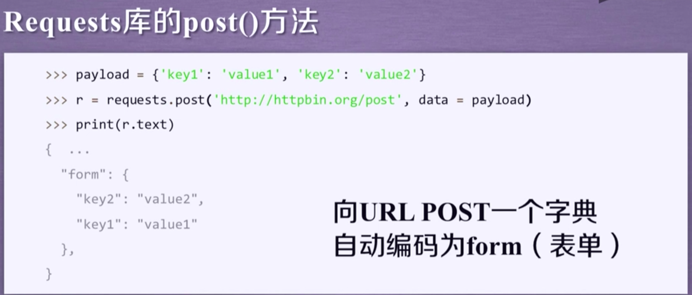

# Requests 库

## Requests 库的7个主要方法

| 方法                | 说明                                           |
| ---                 | ---                                            |
| requests.request( ) | 构造一个请求，支撑一下各方法的基础方法         |
| requests.get( )     | 获取HTML网页的主要方法，对应于HTTP的GET        |
| requests.head( )    | 获取HTML网页头信息的方法，对应于HTTP的HEAD     |
| requests.post( )    | 向HTML网页提交POST请求的方法，对应于HTTP的POST |
| requests.put( )     | 向HTML网页提交PUT请求的方法，对应于HTTP的PUT   |
| requests.patch( )   | 向HTML网页提交局部修改请求，对应于HTTP的PATCH  |
| requests.delete( )  | 向HTML网页提交删除请求，对应于HTTP的DELETE     |

### request( )

```py
requests.request(method, url, **kwargs)
```

- **method: 请求方式， 对应 get/put/post 等7种**

- **url: 拟获取页面的 url 链接**
- ****kwargs: 控制访问的参数，共13个**


### get( )
```py
r = requests.get(url)
```

- **get 构造一个向服务器请求资源的Request对象**
- **requests 返回一个包含服务器资源的Response对象**

```py
requests.get(url, params=None, **kwargs)
```

- **url：拟获取页面的 url 链接** 
- **params：url 中的额外参数，字典或字节流格式，可选**
- ** **kwargs：12 个控制访问的参数** 

### head( )

```py
requests.head(url, **kwargs)
```

- **url：拟获取页面的 url 链接** 
- ****kwargs: 13个访问控制的参数**

```py
>>> import requests
>>> r = requests.head("http://www.baidu.com")
>>> r.headers
{'Cache-Control': 'private, no-cache, no-store, proxy-revalidate, no-transform', 'Connection': 'Keep-Alive', 'Content-Encoding': 'gzip', 'Content-Type': 'text/html', 'Date': 'Sat, 10 Aug 2019 06:12:33 GMT', 'Last-Modified': 'Mon, 13 Jun 2016 02:50:21 GMT', 'Pragma': 'no-cache', 'Server': 'bfe/1.0.8.18'}
>>> r.text
''
```

### post( )

```py
requests.post(url, data=None, json=None, **kwargs)
```

- **url：拟更新页面的 url 链接** 
- **data: 字典、字节序列或文件，Request 的内容**
- **json: JSON 格式的数据，Request 的内容**
- ****kwargs: 11个访问控制的参数**




### put( )

```py
requests.put(url, data=None, **kwargs)
```

- **url：拟更新页面的 url 链接** 
- **data: 字典、字节序列或文件，Request 的内容**
- ** **kwargs：12 个控制访问的参数** 

### patch( )

```py
requests.patch(url, data=None, **kwargs)
```

- **url：拟更新页面的 url 链接** 
- **data: 字典、字节序列或文件，Request 的内容**
- ** **kwargs：12 个控制访问的参数** 

### delete( )

```py
requests.delete(url, **kwargs)
```

- **url：拟删除页面的 url 链接** 
- ****kwargs: 13个访问控制的参数**


## Response 对象的属性

| 属性                | 说明                                               |
|---------------------|----------------------------------------------------|
| r.status_code       | HTTP请求的返回状态，200表示连接成功，404表示失败   |
| r.text              | HTTP响应内容的字符串形式，即url对应的页面内容      |
| r.encoding          | 从HTTP header中猜测的响应内容编码方式              |
| r.apparent_encoding | 从内容中分析出的响应的内容编码方式（备选编码方式） |
| r.content           | HTTP响应内容的二进制形式                           |

## Requests 库异常

| 异常                      | 说明                                        |
| ---                       | ---                                         |
| requests.ConnectionError  | 网络连接错误异常，如DNS查询失败、拒绝连接等 |
| requests.HTTPError        | HTTP错误异常                                |
| requests.URLRequired      | URL缺失异常                                 |
| requests.TooManyRedirects | 超过最大重定向次数，产生重定向异常          |
| requests.ConnectTimeout   | 连接远程服务器超时异常                      |
| requests.Timeout          | 请求URL超时，产生超时异常                   |
| r.raise_for_status( )     | 如果不是200，产生异常requests.HTTPError     |

## 爬取网页的通用代码框架

```py
import requests
def getHTMLText(url):
    '''当 raise_for_status  不是200时发生异常停止程序'''
    try:
        r = requests.get(url, timeout=30)
        r.raise_for_status()
        r.encoding = r.apparent_encoding
        return r.text
        
    except:
        return "产生异常"

if __name__ == "__main__":
    url = "http://www.baidu.com"
    print(getHTMLText(url))
```

## HTTP 协议
- **HTTP，Hypertext Transfer Protocol，超文本传输协议。**
- **HTTP 是一个基于“请求与响应”模式的、无状态的应用层协议。**
- **HTTP 协议采用 URL 作为定位网络资源的标识。**
- **URL 格式http:///host[:port][path]**
-   - **host: 合法的 Internet 主机域名或 IP 地址**
-   - **port: 端口号，缺省端口为80**
-   - **path: 请求资源的路径**
- **URL 是通过 HTTP 协议存取资源的 Internet 路径，一个 URL 对应一个数据资源。**

## HTTP 协议对资源的操作

| 方法   | 说明                                                      |
| ---    | ---                                                       |
| GET    | 请求获取URL位置的资源                                     |
| HEAD   | 请求获取URL位置资源的响应信息报告，即获得该资源的头部信息 |
| POST   | 请求向URL位置的资源后附加新的数据                         |
| PUT    | 请求向URL位置存储一个资源，覆盖原URL位置的资源            |
| PATCH  | 请求局部更新URL位置的资源，即改变该处资源的部分内容       |
| DELETE | 请求删除URL位置存储的资源                                 |


## 网络爬虫的尺寸

| 爬取网页 玩转网页                            | 爬取网站 爬取系列网站                        | 爬取全网                                 |
| :---:                                        | :---:                                        | :---:                                    |
| 小规模，数据量小，爬取速度不敏感，Requests库 | 中规模，数据规模较大，爬取速度敏感，Scrapy库 | 大规模，搜索引擎，爬取速度关键，定制开发 |
| 90%                                          |                                              |                                          |

## 网络爬虫的限制
- **来源审查：判断 User-Agent 进行限制**
-   - **检查来访 HTTP 协议头的 User-Agent 域，只响应浏览器或友好爬虫的访问**
- **发布公告：Robots 协议**
-   - **告知所有爬虫网站的爬取策略，要求爬虫遵守**


